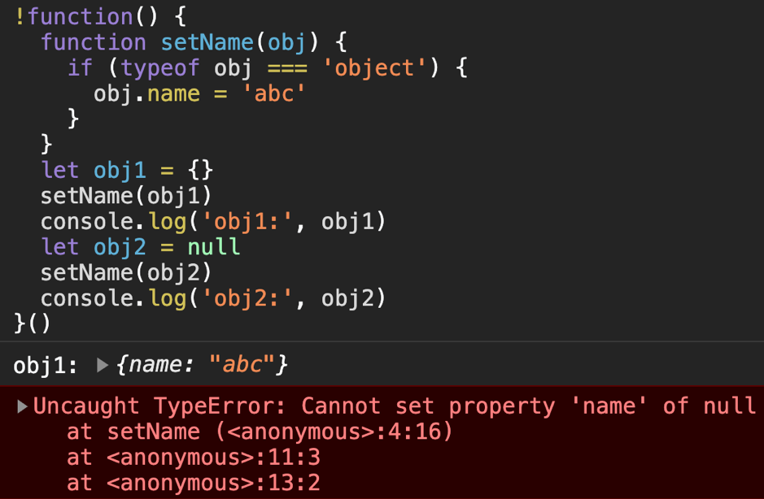
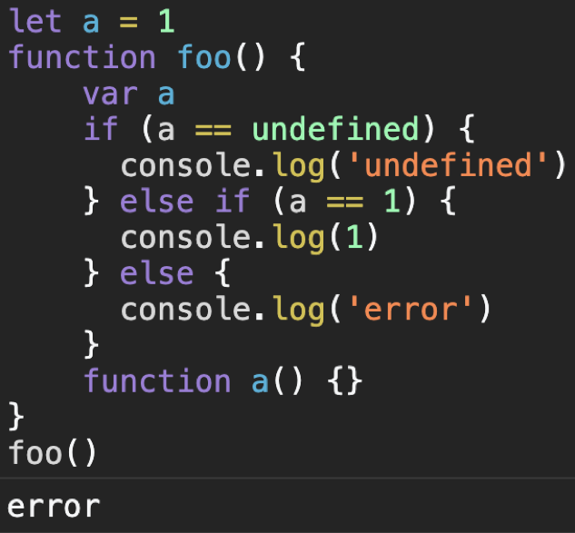
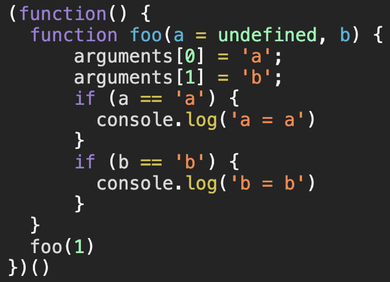
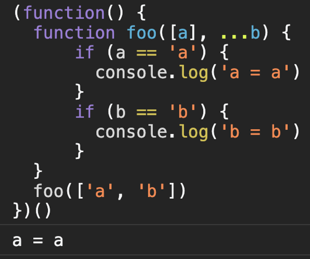
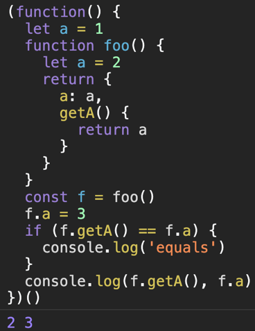
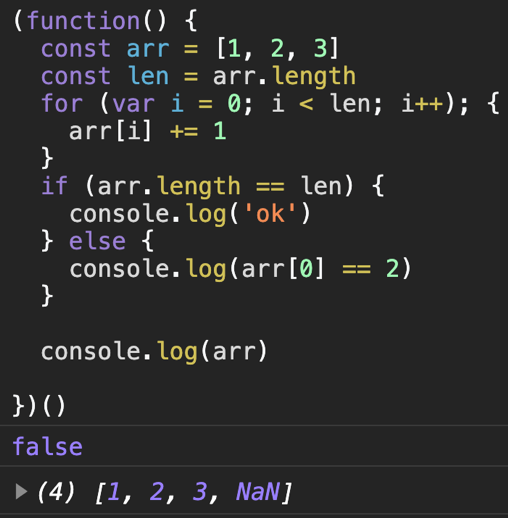
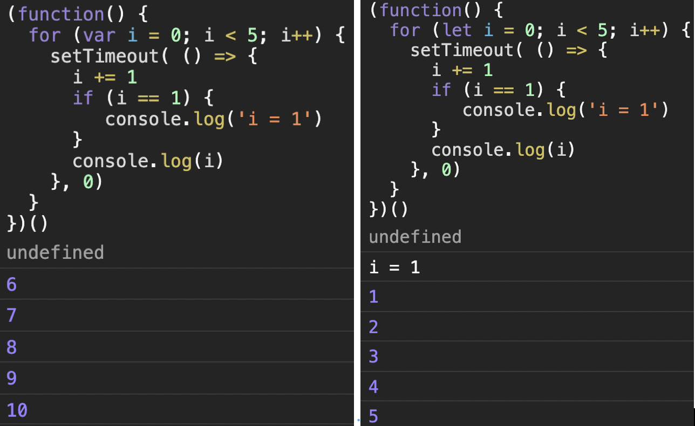
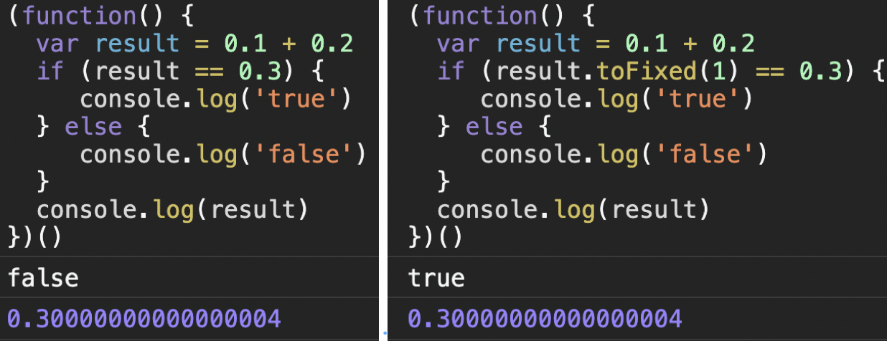
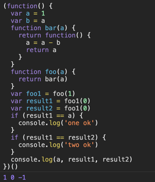

# JS 趣味题与找Bug

## 1. 比较操作时的隐式转换
```js
(function() {
  let a = ''
  let b = []
  if (a == b) {
    console.log('yes')
  }
  if (a == !b) {
    console.log('no')
  }
})()
```
    
* 解释：
    隐式类型转换，当数组为空时，取反为false，与空字符串相等，应该使用严格相等比较。
     1. [] == ![]
     2. [] == false
     3. [] == 0
     4. '' == 0
     5. 0 == 0
 
- 演示结果：


## 2. null不可追加属性
```js
!function() {
  function setName(obj) {
    if (typeof obj === 'object') {
      obj.name = 'abc'
    }
  }
  let obj1 = {}
  setName(obj1)
  console.log('obj1:', obj1)
  let obj2 = null
  setName(obj2)
  console.log('obj2:', obj2)
}()
```
    
* 解释：
    null是一个特殊对象，不可再追加属性。
 
- 演示结果：



## 3. document下的方法不能脱离document运行环境
```js
(function () {
  const query = document.querySelector
  let ele = query('div')
  console.log(ele)
})()
```
    
* 解释：
querySelector必须由document对象调用，函数内部实现的时候通过this访问了document的相关属性,因此不能脱离document
 getElementById,createElement方法都类似。
 
- 演示结果：


## 4. var与let作用域
```js
(function() {
  var a = 1
  if (true) {
    a = 2
    let a
  }
  console.log(a)
})()
```
    
* 解释：
已存在外部var声明的变量a，花括号内又用let声明了同名变量，此次块级作用域被let 声明的a替代，而在let之前引用变量会报错。如果将let a改为var a 不会报错，或者将a = 2放到let a之后也可以。
 
- 演示结果：


## 5. 函数默认值声明采用块级作用域
```js
function foo(a = b, b = 2) {
  console.log(a, b)
}
foo()
```
    
* 解释：
函数默认值也是块级作用域，此时b在形参a之后，故此报错。
 
- 演示结果：


## 6. var变量提升
```js
(function() {
  let a = 1
  function foo() {
    if (a == 1) {
      console.log('a = 1')
    } else {
      var a = 2
      console.log('a = 2')
    }
  }
  foo()
})()
```
    
* 解释：
由于var声明变量存在提升的问题，因此当let定义外部变量a是，foo内部是可以通过作用域链获取到a的值1, 但是因为在函数内部又用var声明了变量a，因此a在foo函数内部的值一开始是undefined，因此无法进入条件分支a == 1。
 
- 演示结果：


## 7. function预处理
```js
let a = 1
function foo() {
    var a
    if (a == undefined) {
      console.log('undefined')
    } else if (a == 1) {
      console.log(1)
    } else {
      console.log('error')
    }
    function a() {}
}
foo()
```
    
* 解释：
函数预处理，外部变量a=1，但内部有定义式函数a，内部a优先，且a的值是函数。
 
- 演示结果：



## 8. arguments与形参默认值问题
```js
(function() {
  function foo(a = undefined, b) {
      arguments[0] = 'a';
      arguments[1] = 'b';
      if (a == 'a') {
        console.log('a = a')
      }
      if (b == 'b') {
        console.log('b = b')
      }
  }
  foo(1)
})()
```
    
* 解释：
有形参a和b，a有默认值，而b无。调用函数传入了1个参数，也就是给a赋值了。此时通过更改arguments[0]无效，b参数非默认值参数，本可以通过arguments[1]更改，但是调用时并没有传值，即使去掉了形参的默认值，通过arguments来更改也无效。因此避免通过arguments与默认值一块使用。
 
- 演示结果：



## 9. rest参数设置
```js
(function() {
  function foo([a], ...b) {
      if (a == 'a') {
        console.log('a = a')
      }
      if (b == 'b') {
        console.log('b = b')
      }
  }
  foo(['a', 'b'])
})()
```
    
* 解释：
两个参数，第一个是扩展符数组，第二是剩余参数，传入时只传入了一个数组，而忽视了后面的参数。
 
- 演示结果：



## 10. 词法作用域（静态作用域）
```js
(function() {
  let a = 1
  function foo() {
    let a = 2
    return {
      a: a,
      getA() {
        return a
      }
    }
  }
  const f = foo()
  f.a = 3
  if (f.getA() == f.a) {
    console.log('equals')
  }
  console.log(f.getA(), f.a)
})()
```
    
* 解释：
a在foo首次执行时返回得到2，f.a更改为3，但getA()函数内的a在定义时的作用域里，通过f.a并不能更改，因此f.getA()里面的a仍然是2。
 
- 演示结果：



## 11. 去重算法忽略了索引下标
```js
const arr = ['a', 'a', 1, 1, 2, 2, 'b', 'b', 2, 1]
function unique(arr) {
  let len = arr.length
  for (let i = 0; i < len; i++) {
    for (let j = i + 1; j < len; j++) {
      if (arr[i] === arr[j]) {
        arr.splice(j, 1)
        len--
        break
      }
    }
  }
  return arr
}
console.log(unique(arr))
```
    
* 解释：
双层循环去掉数组重复项，自左往右遍历，移除重复项后长度递减，当前下标也需要对应移动。
 
- 演示结果：


## 12. 参数值传递
```js
(function() {
  let a = 1;
  let b = {x: 'x'}
  function change(a, b) {
    a = 2
    b = {x: 'y'}
  }
  change(a, b)
  if (a == 2) {
    console.log('a = 2')
  }
  if (b.x == 'y') {
    console.log('b.x = y')
  }
})()
```
    
* 解释：
参数传递是值而不是引用，因此a和b传递的都是值，将值改变后并不会影响原来的变量。
 
- 演示结果：


## 13. 意外的分号
```js
(function() {
  const arr = [1, 2, 3]
  const len = arr.length
  for (var i = 0; i < len; i++); {
    arr[i] += 1
  }
  if (arr.length == len) {
    console.log('ok')
  } else {
    console.log(arr[0] == 2)
  }

  console.log(arr)

})()
```
    
* 解释：
在for循环右侧多出一个意外的分号，导致for循环成为单独语句，从而与下面的赋值脱离。i因为采用var赋值，分号后的花括号可以获取到i的值，因此相当于arr[3] += 1，从而为null，若i采用let声明，则会出现变量i未声明的错误。
 
- 演示结果：



## 14. 分号引发的ASI问题
```js
(function() {
   const obj = {
    foo(a, b) {
      return a + b
    }
  }
  const add = obj['foo']
  [1, 2, 3].map((x) => x += 1)
})()
```
    
* 解释：
在函数后面没有跟分号断句，后面又增加了新的调用，这时候被认为是同一个语句，从而报错。
JavaScript有着自动分号插入的机制(Automatic Semicolon Insertion)，简称ASI。这时候应该加入分号，或者换一种写法。
 
- 演示结果：


## 15. 超时与var作用域问题
```js
(function() {
  for (var i = 0; i < 5; i++) {
    setTimeout( () => {
      i += 1
      if (i == 1) {
         console.log('i = 1')
      }
      console.log(i)
    }, 0)
  }
})()
```
    
* 解释：
setTimeout是一种异步执行的宏任务，在当前块执行完后再执行，再加上var不区分块级作用域，因此在setTimeout块内执行的i+=1操作，i的值是之前for循环完成之后的值。可以通过闭包或let来解决此问题。
 
- 演示结果：



## 16. 浮点数问题
```js
(function() {
  var result = 0.1 + 0.2
  if (result == 0.3) {
     console.log('true')
  } else {
     console.log('false')
  }
  console.log(result)
})()
```
    
* 解释：
JavaScript中所有数字包括整数和小数都只有一种类型 — Number。它的实现遵循 IEEE 754 标准，使用64位固定长度来表示，也就是标准的 double 双精度浮点数（相关的还有float 32位单精度）。这时候可以通过toFixed或者换成字符串来比较。
 
- 演示结果：



## 17. 自动分号(ASI)问题
```js
(function() {
  function foo() {
    return
    {
      a: 1
    }
  }
  const result = foo()
  if (typeof result != 'undefined') {
    console.log('object')
  } else {
    console.log('undefined')
  }
```
    
* 解释：
JS中会自动补齐语句缺失的分号，此例中，return后面的花括号有换行，因此插入了一个分号在return之后，返回值就是undefined，而不是下面的object。
 
- 演示结果：


## 18. 词法作用域(静态作用域)
```js
(function() {
  var a = 1
  function test() {
    if (a == 2) {
      console.log('ok')
    } else {
      console.log('not 2')
    }
  }
  function foo() {
    var a = 2
    test()
  }
  foo()
})()
```
    
* 解释：
相较于动态作用域，大部分语言都是静态作用域，JS也是这样。变量a = 1是外部作用域，函数test里的a作用域在其定义的函数空间内，在执行时顺着作用域链往上查找会指向外层作用域，得到1。而foo里面的var a属于foo空间，并不能覆盖外层的作用域。如果将foo里var a的var去掉，直接赋值则相当于修改了外层的变量，此时就会得到2。
 
- 演示结果：


## 19. 闭包与作用域
```js
(function() {
  var a = 1
  var b = a
  function bar(a) {
    return function() {
      a = a - b
      return a
    }
  }
  function foo(a) {
    return bar(a)
  }
  var foo1 = foo(1)
  var result1 = foo1(0)
  var result2 = foo1(0)
  if (result1 == a) {
    console.log('one ok')
  }
  if (result1 == result2) {
    console.log('two ok')
  }
  console.log(a, result1, result2)
})()
```
    
* 解释：
JS是静态作用域，变量作用域在定义时决定，闭包中的a是形参由外部传入，b是外部变量 ，foo1在执行时会更改闭包中的变量a。因此，第一次foo(1)时a=1，foo1(0)后a=0，再次foo1(0)后a=-1。
 
- 演示结果：



## 20. parseInt错误
```js
(function() {
  const arr = ['010', '2', '10']
  const result = arr.map(parseInt)
  console.log(result)
})()
```
    
* 解释：
map接受两个参数， 回调函数 callback和回调函数的this，当前callback有两个参数，当前项与索引。parseInt接受两个参数string与radix。radix可选，表示要解析的数字的基数。该值介于 2 ~ 36 之间。如果省略该参数或其值为 0，则数字将以 10 为基础来解析。如果它以“0x” 或 “0X” 开头，将以 16 为基数。如果该参数小于 2 或者大于 36，则 parseInt() 将返回 NaN。本例子中，map里callback第二个参数缺省为索引项，相当于arr.map((x, i) => parseInt(x, i))，故此出现意外。
 
- 演示结果：


# Reference

  https://github.com/lydiahallie/javascript-questions#readme
  https://typeofnan.dev/10-javascript-quiz-questions-and-answers/
  https://maxwellito.github.io/es6-quiz-slides/#/
  https://www.reddit.com/r/programming/comments/7qv7pu/javascript_can_a_1_a_2_a3_ever_evaluate_to_true/
  http://javascript-puzzlers.herokuapp.com/
  https://juejin.cn/post/6844903619758669831
  http://perfectionkills.com/javascript-quiz/
  https://www.w3schools.com/js/js_quiz.asp
  https://www.javatpoint.com/javascript-quiz
  


